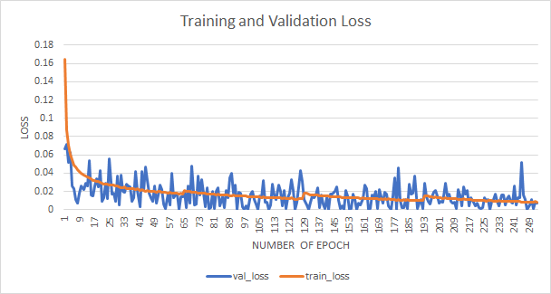

# FaceDetect
Face Detection , Recognition and Gender classification
<h1>FRAS</h1>

To download face recognition weight <a href= "https://drive.google.com/file/d/1CPSeum3HpopfomUEK1gybeuIVoeJT_Eo/view">click here!</a>

To download gender model weight <a href = "https://drive.google.com/file/d/1SXpA6Tu9rWeZJAxkP-GOIDOBs9oynSUi/view?usp=sharing">click here!</a> 

To download gender model <a href = "https://drive.google.com/file/d/1rmudQY5vgUGjTk4s0LcUyLjX_OktFB_a/view?usp=sharing">click here!</a>

Store all the weight and model in the **Utils** folder

Requirement to be pre-installed in the working flow:
* python3
* tensoflow
* keras
* openCV

***Run the index.py file***

## Work Flow
1. Providing the image as input to the system 
* 

2. System returns the captured face if found
* 

3. Gender Identification system returns the gender of the image
* 

4. Enter the input  
F-> for find the image in the database  
S-> for saving the image in the database
* 

5. System Returns the result and get ready for next input. Input "3" for exiting.
* 

## Result

In Face Detection system is the first step in finding the faces from an image, the openCV model used was able to identify the faces from the images 98% of the time provided the condition that there is minimum distortion and rotation of the image.

Face recognition system is based on the VGG-16 neural network which was recommended by various FaceNet and Deep Learning models. On training the model was giving an accuracy of 0.89 with the loss of 0.2678 . On validation dataset the model was able to produce an accuracy of 0.84 with the loss of 0.3125. 

Evaluate the “performance of the classifier” at different epochs. Chart shows the decrease in loss of the model with the training of model for successive epochs. The training loss shows a steady decrease up to 0.0078 before saturation and the validation loss shows a seesaw behavior giving 0.01578 on average. Accuracy of the “Gender classifier model” on both the training and the validation set shows a steady increase of the accuracy with reaching a value of 0.99 and 0.98 before saturation respectively. Example is provided in figure 1.

## FILE -> Index.py

### imports
* ImageInput as IM -> custom
* ImageInputSrc as IMS -> custom (not written till now)
* save_in_folder as SIF -> custom
* find_image as FI -> custom
* cv2 -> prebuilt

Function main() =>
Repeat while TRUE:
1.	Except any of 3 inputs and save it to “choice” variable
  *	1-> For taking image using webcam
  *	2-> For taking image using image source path
  *	3-> For Exiting program
2.	if choice is “1”
  *	curr = “IM.find_face()” # returns the captured and resized image of face
  *	show the image to the user using “OpenCV” library
  *	call “saveOrFind(curr)” to ask whether to find or save the image in the database
3.	if choice is “2”
  *	curr = “IMS.find_face()” # not written now
  *	show the image to the user using “OpenCV” library
  *	call “saveOrFind(curr)” to ask whether to find or save the image in the database
4.	if choice is “3”
  *	PRINT “>>> THANK YOU!!!”
  *	break
5.	If choice anything else
  *	PRINT “>>> WRONG INPUT”

Function saveOrFind(argument: face_img)=>
Repeat while TRUE:
1.	Except any of 2 inputs and save it to “option”
  *	“S” or “s” -> For saving image in database
  *	“F” or “f” -> For finding the image from database
2.	if option is equal to “S” or “s”
  *	SIF.save_img(face_img)
3.	if option is equal to “F” or “f”
  *	call function “FI.who_is_it(face_img)”
4.	If input anything else
  *	break out of the LOOP

